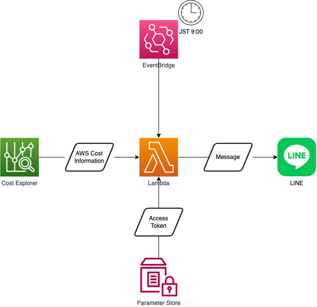

# notify-line-of-aws-billing

## 概要

特定のLINEアカウントまたはLINEグループに対して、メッセージ形式でAWS利用料金を通知します。

## 構成図



## SAMデプロイ方法

1. [LINE Notify公式サイト](https://notify-bot.line.me/ja/)にログインし、アクセストークンを発行  

2. AWSコンソールにログインし、以下の設定内容で、AWS Systems Manager Parameter Storeに発行したアクセストークンを保存  

|名前|種類|値|
|---|---|---|
|/notify-aws-billing/line-access-token|SecureString|<LINEアクセストークン>|

3. 以下コマンドで、SAMアプリをビルド

``` bash
sam build
```

4. 以下コマンドで、SAMアプリをデプロイ

``` bash
sam deploy --parameter-overrides \
  DefaultKmsId=`aws kms describe-key --key-id alias/aws/ssm --query 'KeyMetadata.KeyId' --output text` \
  LineAccessToken=/notify-aws-billing/line-access-token
```

## 参考文献

* [AWSサービス毎の請求額を毎日LINEに通知してみた \| DevelopersIO](https://dev.classmethod.jp/articles/notify-line-aws-billing/)
